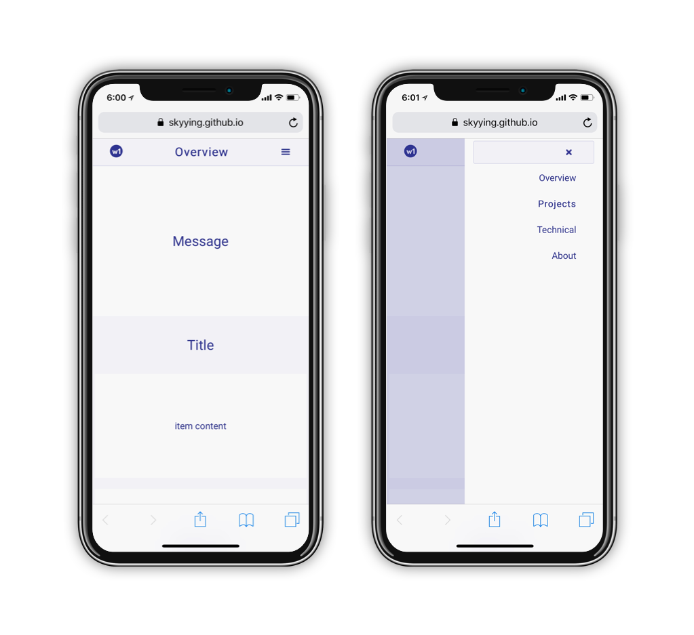
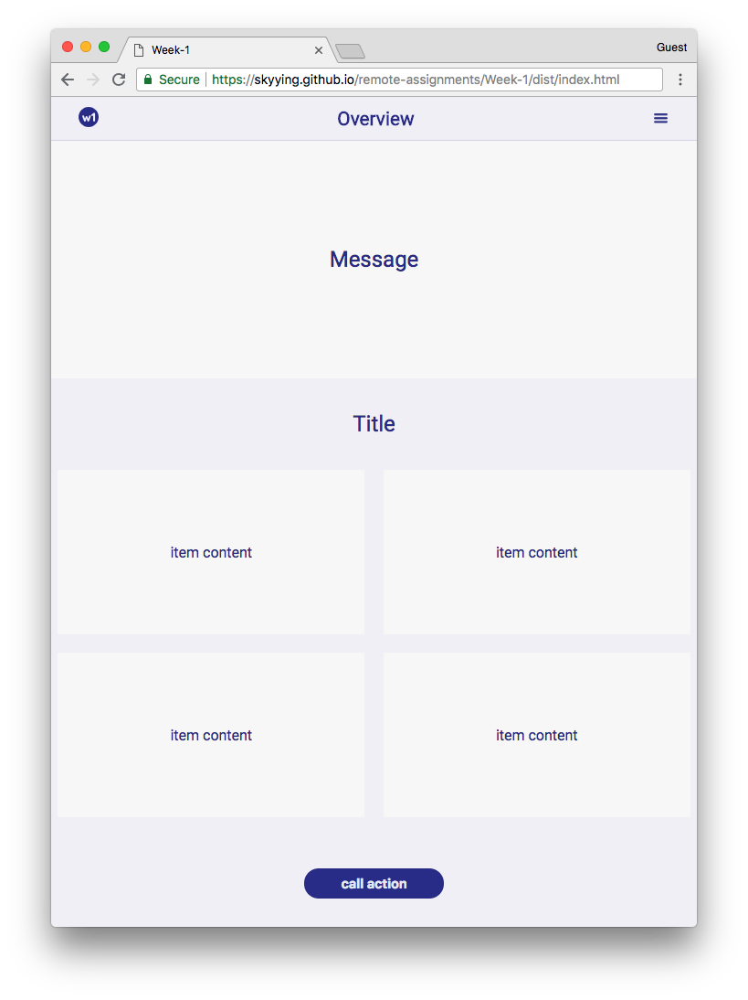
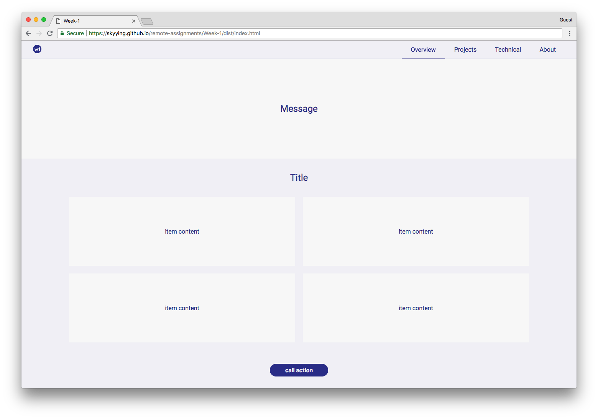

## Week1 - Build a Responsive Web Page

This is the first week assignment, The only requirement is **not** to use any css/javascript framework to build this responsive webpage.

I use `html5`, `css3` and `javascript` to build this webpage, has it tested on the latest chrome, firefox, safari, and microsoft edge.

Though, css/javascript framework is not allowed, I do use css preprocess (SCSS) to improve my workflow. Below is my toolset.

 

## Toolset

### Text-editor

#### vim

I use `vim` as my text-editor.

This time, I made my own css snippets. though, `emmet` is a very powerful tool, still, be able to make one's own snippets can always have a big impact on productivity.

 

### Build tool

#### Webpack

Spent almost two days working on my build process. Read [this great article](https://survivejs.com/webpack/preface/) written by the author of survive.js, Juho Vepsäläinen, it is about how to setup your webpack configs, optimize building performance, so that I don't have to wait too long when made any changes.

 

## Language

#### HTML5 / CSS3(SCSS)

I use CSS 3 flex property as main way to construct the layout. After playing this [flexbox froggy game](https://flexboxfroggy.com/) at least twice, I finally grasp the design concept of flex box.

#### Javascript

still, there are some interaction involved, and it need javascript's help with it. I use javascript to handle the click event on toggle menus. 
 

## Showcase

#### Demo

[View Demo Here](https://skyying.github.io/remote-assignments/Week-1/dist/index.html)

#### on mobile

#### 800px > width > 500px

#### width > 800px

