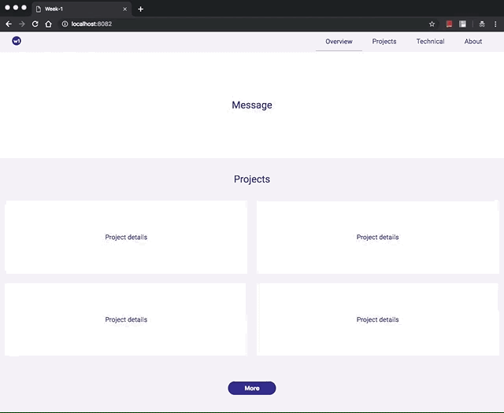

## Week2 - Have fun with Javascript


This week, I add some interaction to the responsive page made last week. Users can load more content on home page now.

<br>


## Tasks


### 1. Write a function to find max value of args

```
const max = (...numbers) => {
    return numbers.reduce((max, val) => Math.max(val, max), Number.MIN_VALUE);
}
```

💻 [code here](./max.js)

<br>

### 2. Create object matches 

Given a function like below, try at least two different ways to create objects as it args.

```
function calculate(args){
	let result;
	if(args.op==="+"){
		result=args.n1+args.n2;
	}else if(args.op==="-"){
		result=args.n1-args.n2;
	}else{
		result="Not supported";
	}
	return result;
}
```

I tried four different ways to create an object.

💻 [code here](./createObject.js)


<br>

### 3. HTML DOM and Event Handling

([View Demo](https://skyying.github.io/remote-assignments/Week-1/dist/index.html))

1. click a DOM element to change text
2. Toggle menu effect  
3. Show more contents after click more button

<br>



<br>

### 4. TwoSum 

Given an array, and a target number, return indexs of any two elements that their sum is the given target number. 

<br>

#### if an array is not sorted

If a given array is sorted, then for every element, we can use hash to query if a complement exists or not. Every element, either already has a complement, if a complement does exist, just return both current index and index of its complement, else add current element and their index to hash table. The time complexity of Hash only take O(1) to search elements, there are n elements, so the worse case of time compleixity will be O(n).

💻 [Code Here](./twoSum.js)

<br>

#### if an array is sorted

there are many ways to approach this, one is using sliding window method, Or can try binary search, which only take o(log N) time.

💻 [Code Here](./twoSum.js)


